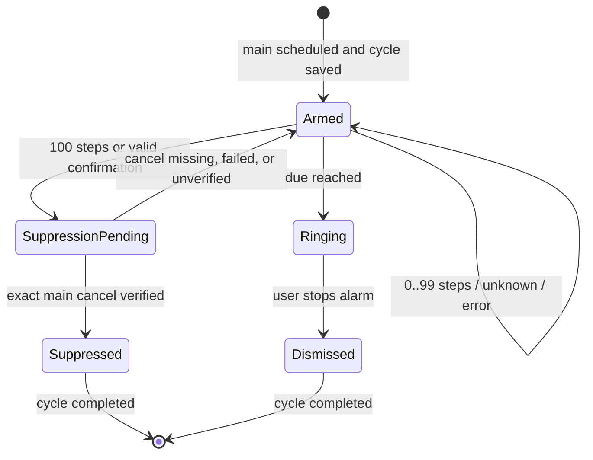

# AlreadyUp 設計

## 1. 目的と安全原則

AlreadyUp は、設定時刻に実際の音を鳴らし、期限前に100歩の起床行動または本人の明示操作を確認できた場合だけ、対応する1周期のアラームを抑止する。

> 起きていると確定できない場合は、アラームを残す。

最重大事故は「本当は寝ているのに、推定や処理失敗によってアラームを止めること」である。誤って鳴ることは許容しても、正の証拠と OS 上の取消確認なしに止めることは許容しない。

## 2. 現行スコープ

### 含む

- 最大10件のアラーム設定
- 今日だけ、毎日、平日、曜日指定
- 設定ごとのオン／オフと削除
- 各設定の先3周期を個別 local notification として予約
- foreground Pedometer の100歩
- 期限直前の actionable notification
- 対象周期だけを cancel する fail-safe policy
- foreground ループ音
- v1 単一アラーム保存形式から v2 複数形式への移行

### 含まない

- 睡眠そのものの推定
- background での継続的な歩数監視
- AlarmKit / Critical Alerts による鳴動保証
- スヌーズ
- アラーム名、音、振動の編集
- 先3周期をバックグラウンドで永続的に補充する native scheduler
- watchOS 専用アプリ

## 3. データモデル

### 3.1 Alarm definition

```ts
interface StoredAlarmDefinition {
  id: string;
  hour: number;
  minute: number;
  repeat: AlarmRepeat;
  enabled: boolean;
  createdAtMs: number;
  cycles: StoredAlarm[];
}

type AlarmRepeat =
  | { kind: 'today'; weekdays: []; dateKey: string }
  | { kind: 'daily'; weekdays: [0, 1, 2, 3, 4, 5, 6] }
  | { kind: 'weekdays'; weekdays: [1, 2, 3, 4, 5] }
  | { kind: 'custom'; weekdays: Weekday[] };
```

曜日はローカル timezone の `0=日` から `6=土` で保存する。`today` は日付を `YYYY-MM-DD` として固定し、過去時刻を翌日へ繰り越さない。

### 3.2 Alarm cycle

```ts
interface StoredAlarm {
  alarmId: string;
  cycleId: string;
  mainAlarmId: string;
  checkInNotificationId?: string;
  armedAtMs: number;
  dueAtMs: number;
  phase: 'armed' | 'step_candidate' | 'suppressed' | 'ringing' | 'dismissed';
  stepCount: number;
  stepCandidateAtMs?: number;
  confirmedAtMs?: number;
  stepCandidateRecorded: boolean;
}
```

`alarmId` はユーザー設定、`cycleId` は特定日の特定時刻を識別する。通知 action の `cycleId`、保存済み `mainAlarmId`、check-in request ID の全てが一致しない限り cancel しない。

## 4. 繰り返し計算

`getUpcomingAlarmTimes` はローカル date を1日ずつ進め、repeat rule に一致する未来時刻を最大3件返す。

| repeat | 次回計算 |
|---|---|
| 今日だけ | 保存した当日かつ現在より後だけ |
| 毎日 | 次に到来する全曜日 |
| 平日 | 月〜金だけ |
| 曜日指定 | 選択した1曜日以上だけ |

全て one-off `DATE` trigger とする。同じ recurring request を使わないのは、1周期だけを安全に cancel し、古い応答が将来周期へ波及することを防ぐためである。

## 5. 通知予算

iOS は保留 local notification を直近64件まで保持する。AlreadyUp は次の上限を固定する。

```text
10 alarm definitions
× 3 upcoming cycles
× 2 notifications (main + check-in)
= 60 pending notifications maximum
```

予約枠はアプリ起動時、起床確認成功時、鳴動停止時に補充する。アプリを3周期以上開かない場合の継続補充は未実装であり、本番 release gate とする。

## 6. 予約シーケンス

各周期は次の順序で予約する。

1. 入力時刻と repeat rule を検証する。
2. 一意な `cycleId` を作成する。
3. main alarm を OS に登録し、`mainAlarmId` を得る。
4. 最大60秒前の check-in を登録する。
5. definition と cycle を AsyncStorage v2 に保存する。

main を必ず先に登録する。check-in の登録に失敗しても main を残し、警告を返す。main の登録に失敗した周期は「予約済み」と表示しない。

## 7. 起床証拠と抑止

### 7.1 100歩

- foreground で最も近い未来周期だけを監視する。
- 99歩以下は main を変更しない。
- 100歩以上でも `armedAtMs <= observedAtMs < dueAtMs` を満たさない場合は拒否する。
- 保存済み `mainAlarmId` を cancel し、OS pending 一覧から消えたことを確認した場合だけ `suppressed` にする。
- 別設定、別日、次の周期は変更しない。

### 7.2 明示確認

check-in notification の「起きています」は、次の全条件を満たす場合だけ有効である。

1. action identifier が `confirm_awake`。
2. kind が `awake_checkin`。
3. cycle、main request、check-in request が保存済み周期と一致。
4. 保存 phase が `armed` または `step_candidate`。
5. 確認時刻が check-in window 内かつ期限前。
6. main cancel 後、OS pending 一覧で消失を確認。

古い通知、default tap、重複 action、期限後 action、取消例外では main を残す。

## 8. 状態遷移



期限と証拠が同時に競合する場合はアラームを優先する。

## 9. 複数アラーム操作

### オフ

definition が持つ check-in と main を個別に cancel し、OS pending 一覧で消失を確認する。成功後に `enabled=false`、`cycles=[]` を保存する。確認できなければ設定を変更せずエラーを表示する。

### オン

repeat rule から先3周期を再計算し、新しい cycle ID と notification ID を発行する。過去になった「今日だけ」は再利用せず、新規作成を求める。

### 削除

確認ダイアログ後、対象 definition の通知だけを解除する。解除成功後に definition を削除する。

### 鳴動停止・起床確認後

`today` は無効化する。繰り返し設定は完了周期を残りの周期と区別し、予約枠を最大3件へ補充する。

## 10. 保存と移行

- v2 key: `already-up/alarm-definitions/v2`
- legacy key: `already-up/active-alarm/v1`
- v2 は `{ version: 2, alarms }` として保存する。
- ID 重複、時刻範囲、repeat rule、cycle shape、最大10件を load / save の両方で検証する。
- 全ての read-modify-write は直列 mutation queue 内で最新値を読み直し、通知応答・歩数更新・画面操作・起動時補充が互いの保存結果を古い snapshot で上書きしない。
- v2 が存在せず valid な v1 がある場合、`today` definition 1件へ移行し、v2 保存成功後に v1 key を削除する。
- malformed data では推測復旧せず、予約済み通知を勝手に解除しない。

## 11. UI 契約

- 上部はブランド、画面タイトル、追加ボタンだけにし、prototype / presentation 表示を置かない。
- 次回アラームは時刻、日付、残り時間、100歩進捗を表示する。
- 通常文字サイズでは有効時 / idleのsummary cardを同じ140pt固定高とし、一覧の開始位置を動かさない。Dynamic Typeのアクセシビリティscroll時だけ、文字を切らないため同じ140pt最小高から内容に応じて拡張する。
- 設定一覧は時刻、repeat label、次回日付、toggle、予約周期数、削除を表示する。
- メイン画面は viewport 内に固定し、ページ全体をスクロールさせない。アラーム一覧だけを独立した `ScrollView` とし、件数が増えた場合もヘッダー、次回アラーム、追加導線を固定する。
- Dynamic Type の `fontScale > 1.3` では情報欠落を避けるアクセシビリティ例外として外側スクロールを許可し、通常文字サイズでは一覧以外を固定する。
- 追加フォームはメイン画面の layout tree に挿入せず、背景を blur する `Modal` 上のサブ画面として表示する。時刻、4種類の repeat、custom weekday、100歩の説明を持ち、小さい画面ではフォーム本体だけを内部スクロールする。
- 時刻設定の標準操作はnative pickerとする。iOSはmodal内の先頭に`display="spinner"`の216pt wheelを切らずに常時表示し、Androidは公式推奨のimperative APIで`display="clock"` dialogを開く。選択時刻と`数字で入力`はpicker後段のsecondary controlとし、表示時刻をタップした場合だけ時・分のnumeric keyboard inputへ切り替える。入力は`0..23` / `0..59`を確定時に検証し、不正値では親のalarm stateを更新しない。編集中はpickerを閉じて追加CTAを無効化する。`fontScale > 1.3`では横並びcopyを縦積みにする。
- 状態通知はstatus barの下、brand rowより上のabsolute overlay layerへspring表示し、メインlayoutを押し下げない。上端のdrag handleでgestureを示し、閉じるbuttonに加えて、上方向へ32px以上または十分な上向き速度でswipeするとdismissし、未達gestureは元の位置へ戻す。Reduce Motion時は自動springを無効化する。
- 追加エラーはスクロール領域外の固定footerに表示し、dangerはassertive、その他の状態通知はpoliteとしてassistive technologyへ通知する。
- iOS 26 以降は `expo-glass-effect` の native Liquid Glass を使う。旧iOSとWebは `expo-blur`、AndroidはSDK 54で実blurがexperimentalなため安定した半透明 surfaceへfallbackする。Reduce Transparency 有効時はsemantic stateを保った不透明度の高い surface に切り替える。
- Apple HIGに従い、Glassはcontent cardの背景に使わず、追加、通知、時刻編集、選択lens、確定などcontent上に浮くfunctional control layerへ限定する。大面積の次回表示・一覧・alarm cardはstandard materialとする。
- repeat controlは1つのglass lensを選択肢間でspring移動させ、単なる背景色の切替にしない。native GlassView自体のopacityはanimateせず、wrapperのgeometryを移動する。Reduce Motion時は選択位置を即時更新する。
- Glass surface 上でも本文・操作のコントラストを維持し、tintは主操作・選択・statusの意味がある箇所だけに使う。glass-on-glassを避ける。
- Web は UI smoke test とし、通知操作を disabled にする。

## 12. Platform 制約

| 制約 | 現行動作 |
|---|---|
| Pedometer background 非対応 | 起床確定にせず main を残す |
| 歩数監視 window 未確定 | 最も近い未来周期を foreground 中に監視。日中歩行の混入防止は release gate |
| 通知権限拒否 | 新規アラームを追加しない |
| check-in 登録失敗 | main を残し警告 |
| main 登録失敗 | 周期を保存しない |
| cancel 未確認 | `suppressed` にしない |
| Focus / 消音 / 音量 | 鳴動保証なし。release gate で扱う |
| app terminated 時の action | JS handler 不実行の可能性。main が残る安全側 failure |
| 3周期を越える未起動 | 追加周期が補充されない |
| production app identity 未確定 | `app.alreadyup.prototype` を維持し、人間承認なしに app identity を変更しない |
| Web native time picker非対応 | dialはExpo Go実機で使用する旨を表示し、UI / bundle smokeだけ行う |

## 13. Verification matrix

| ID | シナリオ | 期待結果 |
|---|---|---|
| POL-01 | 99歩 | 対象 main を維持 |
| POL-02 | 期限前100歩 + cancel verified | 対象周期だけ suppress |
| POL-03 | 期限時100歩 | main 優先 |
| POL-04 | 古い cycle action | 現周期を維持 |
| REP-01 | 毎日 | 次の3日を計算 |
| REP-02 | 金曜の平日設定 | 月・火・水を計算 |
| REP-03 | 過去の今日だけ | 翌日へ繰り越さず拒否 |
| MUL-01 | 2設定の片方を suppress | 他方の IDs は不変 |
| MUL-02 | toggle off | 対象 definition の通知だけ解除 |
| MUL-03 | delete | 対象 definition だけ削除 |
| UI-01 | アラームをoff / on | summary card高と一覧開始位置が変わらない |
| UI-02 | noticeを短く上swipe | bannerは元位置へ戻る |
| UI-03 | noticeを32px以上または高速で上swipe | bannerをdismiss |
| UI-04 | iOS wheel / Android clock | 選択時刻が親formへ反映 |
| UI-05 | 表示時刻をタップ | keyboard direct inputへ切り替え |

## 14. 参照資料

- [Expo Notifications — SDK 54](https://docs.expo.dev/versions/v54.0.0/sdk/notifications/)
- [Expo Pedometer — SDK 54](https://docs.expo.dev/versions/v54.0.0/sdk/pedometer/)
- [Expo DateTimePicker — SDK 54](https://docs.expo.dev/versions/v54.0.0/sdk/date-time-picker/)
- [React Native 0.81 PanResponder](https://reactnative.dev/docs/0.81/panresponder)
- [Apple: Scheduling a notification locally](https://developer.apple.com/documentation/usernotifications/scheduling-a-notification-locally-from-your-app)
- [Apple: UILocalNotification pending limit](https://developer.apple.com/documentation/uikit/uilocalnotification)
- [Apple Watch notifications](https://support.apple.com/guide/watch/notifications-apd9b833c9f3/watchos)
