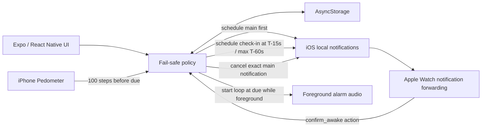
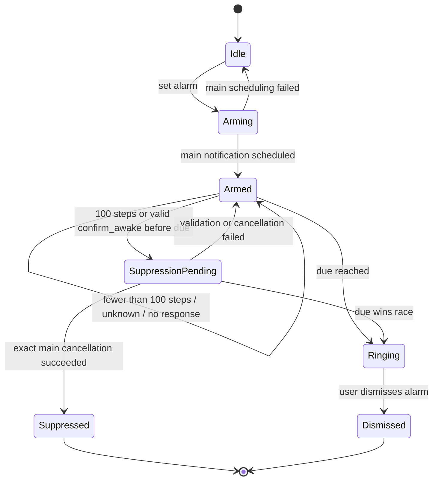

# AlreadyUp MVP 設計

## 1. 目的

AlreadyUp は、設定時刻に実際の音を鳴らし、アラーム前に 100 歩の起床行動または本人の明示操作を確認できたときだけ、対応するメインアラームを抑止するアプリである。

最優先の安全要件は次の 1 文に集約される。

> 起きていると確定できない場合はアラームを鳴らす。

避けるべき最重大事故は「本当は寝ているのに、推定や処理失敗によってアラームを止めてしまうこと」である。そのため、誤って鳴ること（false positive）は許容しても、誤って止めること（unsafe suppression）は許容しない。

## 2. MVP の境界

### 含む

- 1 件のメインアラームをローカル通知として先にスケジュールする
- 起床時刻を時刻ピッカーで設定し、発表用には 30 秒後の短縮経路を用意する
- 通常は最大 60 秒前、30 秒デモでは 15 秒前に起床確認通知を表示する
- 確認通知の「起きています」アクションで、対応するメインアラームだけを停止する
- iPhone の Pedometer で foreground 中の 100 歩を起床確定として検知し、対応するメインアラームだけを停止する
- 期限到達時、foreground ではループ音、background では local notification の通知音を鳴らす
- iPhone の actionable notification を Apple Watch に転送して操作できるようにする
- 有効なアラーム周期を端末内に保存し、古い応答と区別する

### 含まない

- HealthKit の睡眠ステージによる自動抑止
- watchOS 専用アプリ、WatchConnectivity、Watch 側の独自センサー処理
- バックグラウンドでの継続的な歩数監視
- 通常通知を越える鳴動保証
- 複数アラーム、繰り返し、スヌーズ
- armed 中の手動解除（誤操作による鳴動漏れを避けるため）
- 細かなエラー復旧と全ライフサイクルの網羅

HealthKit や Apple Watch の自動睡眠判定は、Watch を着けていない可能性があること、リアルタイムの起床確定として扱いにくいことから MVP の根拠にはしない。

## 3. 用語と証拠レベル

| 用語 | 意味 | アラーム停止の根拠になるか |
|---|---|---|
| `UNKNOWN` | 起床を確定できる情報がない | ならない |
| `STEP_THRESHOLD_REACHED` | アラーム設定後、期限前に iPhone が 100 歩を検知 | なる |
| `CONFIRMED_AWAKE` | 有効な確認通知で、期限前に「起きています」を明示操作 | なる |
| `STALE` | 古い周期、別のアラーム、期限外の確認 | ならない |
| `ERROR` | 権限、センサー、保存、応答、キャンセル等の失敗 | ならない |

100 歩は睡眠そのものの推定ではなく、この MVP が採用する明確な起床行動である。99 歩以下、期限後の到達、センサー欠落・例外は停止根拠にしない。100 歩到達時も OS 上の対象通知が消えたことを確認できるまで `suppressed` にしない。

`CONFIRMED_AWAKE` はアラーム直前に提示した通知への能動操作であり、100 歩と並ぶ正の証拠である。確認後に再睡眠する残余リスクはあるが、本人の能動操作として採用する。

## 4. 全体構成



Watch から独自データを送るのではなく、iOS アプリが登録した通知カテゴリとアクションを Watch 側に転送する。この構成では watchOS target を追加せずに MVP を試せる。

## 5. データ契約

有効な周期は最低限、次の情報を一体として扱う。

```ts
type AlarmCycle = {
  cycleId: string;
  mainAlarmId: string;
  checkInNotificationId?: string;
  armedAtMs: number;
  dueAtMs: number;
  phase: 'armed' | 'step_candidate' | 'suppressed' | 'ringing' | 'dismissed';
  stepCount: number;
  stepCandidateAtMs?: number;
  confirmedAtMs?: number;
  stepCandidateRecorded: boolean;
};
```

確認通知の payload は、別周期の通知を誤って適用しないため、次の相関情報を持つ。

```ts
type AwakeCheckInData = {
  kind: 'awake_checkin';
  cycleId: string;
  mainAlarmId: string;
};
```

- category identifier: `awake_checkin`
- action identifier: `confirm_awake`
- action label: `起きています`

category / action identifier は固定値とし、表示文字列で判定しない。

## 6. スケジュール手順

アラーム設定時は、次の順序を崩さない。

1. 通知権限と通知カテゴリを準備する。
2. `cycleId` と `dueAtMs` を確定する。
3. メインアラームを OS にスケジュールし、`mainAlarmId` を得る。
4. 通常は最大 `dueAtMs - 60 秒`、30 秒デモでは `dueAtMs - 15 秒` に確認通知をスケジュールし、その通知 ID を得る。
5. メイン ID と確認通知 ID を含む有効周期を保存する。
6. Pedometer の foreground 監視を開始する。

メインを先に登録するのは、確認通知やセンサーの準備に失敗してもアラームを残すためである。プロセスが保存前に終了しても OS 上のメイン通知は残る。メイン通知のスケジュール自体が失敗した場合は「設定済み」と表示してはならない。確認通知のスケジュールが失敗した場合は、メインを残したまま警告状態にする。

## 7. 判定フロー

### 7.1 100 歩を検知した場合

1. 現在の周期に対する歩数を更新する。
2. 100 歩未満ではメインアラームを変更しない。
3. 100 歩以上でも、現在周期が active かつ期限前であることを検証する。
4. 保存済みの正本 ID を使い、メイン通知 1 件だけをキャンセルする。
5. OS の scheduled notification 一覧で対象 ID の消失を確認できた場合だけ `suppressed` を保存する。
6. 確認通知は best-effort で取り消し、失敗してもメイン通知の停止結果を巻き戻さない。

期限後、古い周期、99 歩以下、キャンセル例外、またはキャンセル結果を確認できない場合は `suppressed` に遷移せず、アラームを残す。

### 7.2 「起きています」を操作した場合

以下をすべて満たす場合に限り、抑止処理へ進む。

1. action identifier が厳密に `confirm_awake` と一致する。
2. payload の `kind` が `awake_checkin` である。
3. payload の `cycleId` が現在有効な周期と一致する。
4. payload の `mainAlarmId` が現在有効なメイン通知 ID と一致する。
5. response の通知 ID が現在の `checkInNotificationId` と一致する。
6. 確認時刻がその周期の `checkInAtMs` 以降かつ `dueAtMs` より前である。
7. 現在の周期がまだ `armed` または `step_candidate` である。

条件を満たしたら、payload ではなく保存済みの正本 ID を使ってメイン通知 1 件だけをキャンセルする。キャンセル前後の OS の scheduled notification 一覧で対象 ID の存在と消失を検証し、成功を確認したあとに `suppressed` と `confirmedAt` を保存する。

不一致、期限切れ、重複応答、例外、キャンセル失敗では `suppressed` に遷移しない。期限と同時の競合はアラーム優先とする。

### 7.3 無応答・通常タップ・dismiss

何もしない。メイン通知は OS に残る。

## 8. 状態遷移



100 歩到達は抑止処理の入口だが、OS 上の対象通知のキャンセル成功を確認した場合だけ `Suppressed` へ遷移する。

## 9. Watch routing matrix

iOS の通知は通常、iPhone と Watch の両方に同時表示されるのではなく、端末状態に応じて配送先が選ばれる。

| iPhone | Apple Watch | 期待される主な配送先 | MVP 上の扱い |
|---|---|---|---|
| アンロック・使用中 | 任意 | iPhone | iPhone で同じアクションを操作可能 |
| ロック中またはスリープ | 装着・アンロック・接続中 | Apple Watch | Watch での主要デモ経路 |
| ロック中またはスリープ | ロック中・未装着 | iPhone | Watch 確認なし。無応答なら鳴る |
| ロック中またはスリープ | 未接続・電源断・圏外 | iPhone | Watch 確認なし。無応答なら鳴る |
| 任意 | 通知ミラーリング無効 | iPhone | 設定案内が必要 |
| 任意 | Focus / 通知制限あり | OS 設定に依存 | 配送・音を保証しない |

この表は Apple の一般的な forwarding ルールに基づく。実際の action 表示、Focus、ロック、接続復帰、複数 Watch 等の組み合わせは実機検証を残 Issue とする。

## 10. ライフサイクルと fail-safe

| 事象 | 安全側の結果 |
|---|---|
| アプリ再起動 | 保存済み周期を復元し、確認できなければメインを残す |
| action response を取得できない | メインを残す |
| 古い action response を再取得 | cycle / ID / deadline 検証で無視する |
| 保存読み込み失敗 | メインを推測でキャンセルしない |
| Pedometer 権限拒否・停止 | 100 歩を確認できないためメインを残す |
| 確認通知の登録失敗 | メインを残し、確認不能を表示する |
| メイン通知のキャンセル失敗 | `suppressed` にせず、メインを残す |
| OS 時刻変更・再起動 | 現 MVP では完全未対応。メインを推測で消さない |

`getLastNotificationResponse` 等で cold start 時の応答を回収しても、必ず有効周期との相関を検証する。アプリが terminated の状態で Watch の action が JavaScript まで届くことは未検証であり、本番化前の P0 Issue とする。

## 11. 鳴動方式と限界

期限到達時にアプリが foreground なら、`expo-audio` で端末内生成した WAV をループ再生する。`playsInSilentMode` を有効にするが、JavaScript が停止する background / terminated 状態ではこのループは継続保証できない。その場合は先に登録した通常の local notification の通知音を使う。

したがって、次を越えた鳴動保証はない。

- 通知権限の拒否または変更
- iPhone の消音、通知音量、Focus、Scheduled Summary 等
- Apple Watch 側の消音、Focus、装着・ロック状態
- OS の配送遅延、端末電源断、再起動

「不明なら通知を OS に残す」というアプリ内の fail-safe と、「音が必ず出る」という OS レベルの保証は別問題である。後者は AlarmKit、Critical Alerts entitlement、native integration、実機検証を含めて解決する必要がある。

## 12. 受け入れテスト

| ID | 条件 | 期待結果 |
|---|---|---|
| POL-01 | 証拠なしで期限到達 | 鳴る |
| POL-02 | 99 歩以下で期限到達 | 鳴る |
| POL-03 | 現在周期で期限前に 100 歩へ到達し、対象通知の消失を検証 | 対象だけ抑止 |
| POL-04 | 正しい周期・確認通知 ID の `confirm_awake` を確認可能時刻以降・期限前に操作 | 対象だけ抑止 |
| POL-05 | 古い周期の `confirm_awake` | 現在のアラームは鳴る |
| POL-06 | 別メイン ID の `confirm_awake` | 現在のアラームは鳴る |
| POL-07 | 確認可能時刻より前、または別の確認通知からの応答 | 鳴る |
| POL-08 | `dueAtMs` と同時または後の応答 | 鳴る |
| POL-09 | キャンセル API が失敗 | 鳴る側を維持 |
| POL-10 | 前周期で確認後、新しい周期を設定 | 新周期は自動抑止されない |
| LIFE-01 | バックグラウンド中に Watch で有効 action | 期限前に対象だけ抑止 |
| LIFE-02 | terminated 中に Watch で有効 action | 未検証。P0 Issue |
| ROUTE-01 | iPhone ロック、Watch 装着・アンロック | Watch に action が表示される |
| ROUTE-02 | iPhone アンロック | iPhone に action が表示される |

ポリシーテストが通っても OS 配送を証明したことにはならない。`LIFE-*` と `ROUTE-*` は iPhone / Apple Watch 実機で別途検証する。

## 13. 公式資料

- [Expo Notifications — SDK 54](https://docs.expo.dev/versions/v54.0.0/sdk/notifications/)
- [Expo Pedometer — SDK 54](https://docs.expo.dev/versions/v54.0.0/sdk/pedometer/)
- [Expo Audio — SDK 54](https://docs.expo.dev/versions/v54.0.0/sdk/audio/)
- [Expo FileSystem — SDK 54](https://docs.expo.dev/versions/v54.0.0/sdk/filesystem/)
- [Expo: Create a project（物理デバイスの Expo Go は SDK 54）](https://docs.expo.dev/get-started/create-a-project/)
- [Taking advantage of notification forwarding](https://developer.apple.com/documentation/watchos-apps/taking-advantage-of-notification-forwarding)
- [Adding actions to notifications on watchOS](https://developer.apple.com/documentation/watchos-apps/adding-actions-to-notifications-on-watchos)
- [Apple Watch notifications](https://support.apple.com/guide/watch/notifications-apd9b833c9f3/watchos)
